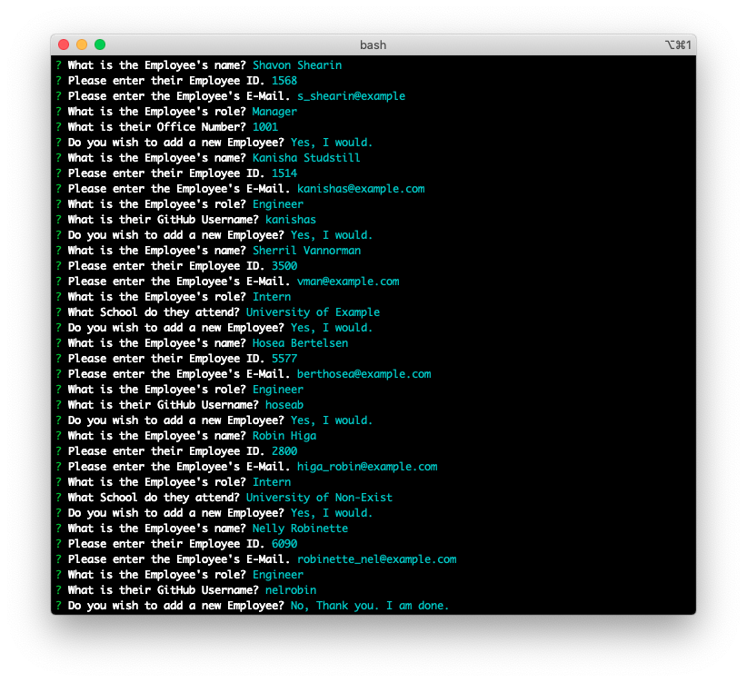

# opus10_employee-directory

  

## Description

This is a command-line application to generate an HTML document for a software engineering team. The user can input as many employees as needed using the command-line, and when finished, the program generates an HTML file, or writes over a previous one. 

The idea behind this project is that this application is to provide a simple way to input employee information and then display it. This will allow for easy access to team member e-mails and GitHub profiles.  

Each Employee role has their own specific sub-class, and there are tests provided for them.

## Table of Content

* [Installation](#installation)

* [Repository](#repository)

* [Usage](#usage)

* [License](#license)

* [Contributing](#contributing)

* [Tests](#tests)

* [Questions](#questions)

## Installation

There are several package dependencies for this appliction. They are [inquirer](https://www.npmjs.com/package/inquirer), for the input, and [jest](https://jestjs.io/) to run the tests. It is suggested that the user run `npm install` before running the application, to ensure that the dependencies are up to date.


## Repository

This project's repository is at: [opus10_employee-directory](https://github.com/AJFree458/opus10_employee-directory)

## Usage

First, cd to the directory that the application is in. Install dependencies, if needed, then run with:

```
node app.js
```

After you have run the command, follow the instructions on the command-line.

Here is an example of the command-line with some data:



This is the generated HTML from the command-line:


## License


This project currently does not have a license.

## Contributing

Please report issues and concerns. Fork the repo if desired, and do requests.

## Credit

Main Contributor: Arthur Freeman

## Tests

To run tests, run the following command:

```
npm run test
```

## Questions


If you have any questions about the repo, open an issue or contact [AJFree458](https://api.github.com/users/AJFree458) directly at rthr.frmn@gmail.com.
